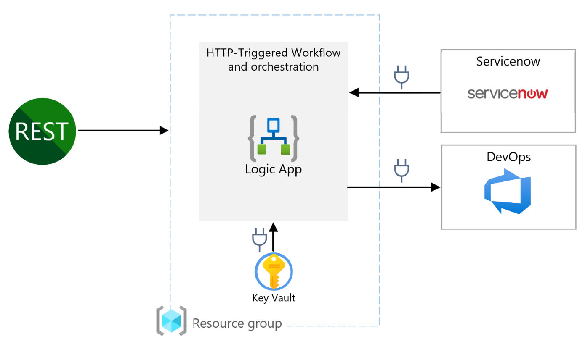
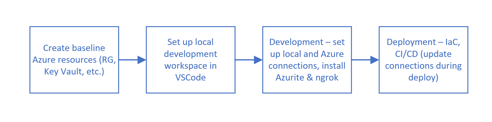

# logicapps-standard-devops

[This guide](https://learn.microsoft.com/en-us/azure/logic-apps/create-single-tenant-workflows-visual-studio-code) provides a great quickstart for setting up Logic Apps Standard workflows in VSCode.

[This repository](https://github.com/rutzsco/demo-logic-apps-standard-devops) served as an example for much of the development of this codebase; a good deal of the material from it is referenced here.

The codebase in my repository seeks to focus on a more "real-world" usecase of automating data movement between ServiceNow and Azure DevOps, and the README here lays out more steps for demystifying the somewhat challenging developer local-to-cloud workflow for Logic Apps Standard.

Azure Logic Apps Standard provides an opportunity to enable a traditional developer workflow, and associated benefits (local development, source control, automation) with low code tooling. The goal of this repository is to augment existing documentation to accelerate the use of CICD practices enabled with [Azure Logic Apps Standard](https://docs.microsoft.com/en-us/azure/logic-apps/devops-deployment-single-tenant-azure-logic-apps). This is accomplished by providing a demo implementation and highlighting best practices and workarounds to common challenges.

**_Aligns with traditional CI/CD Delivery Model_**

**_Separation of Concerns_**

The single-tenant model gives you the capability to separate the concerns between app and the underlying infrastructure. For example, you can develop, build, zip, and deploy your app separately as an immutable artifact to different environments. Logic app workflows typically have "application code" that you update more often than the underlying infrastructure. By separating these layers, you can focus more on building out your logic app's workflow and spend less on your effort to deploy the required resources across multiple environments.

## CICD Design

## Solution Architecture

---

## Local Development Flow:

At a high level, the developer workflow for local-to-cloud development of Logic Apps is:

### 1. Create the following Azure Resource(s) before local development:

- Resource Group
  - Since this needs to be crated before development activities, name this with something that matches the intended environment
  - The name of the Resource Group will be when deploying infrastructure, paired with your defined variables.
- Any auxiliary dependant resources, e.g., Key Vaults
  - These need to be created in Azure before/as needed throughout development since they are referred to by actions throughout development.
- It is best practice to use Infrastructure as Code (e.g., Bicep) to deploy these auxiliary resources.

### 2. Set up your local workspace

- Follow the full setup guide [here](https://docs.microsoft.com/en-us/azure/logic-apps/create-single-tenant-workflows-visual-studio-code#prerequisites)

- NOTE: When setting up your designer locally, make sure you choose 'Use Azure Connectors'

- NOTE: When using a Key Vault, you should:
  - Use the 'Azure Key Vault' action, not the 'Key Vault' action.
  - If using 'Service Principal Authentication', ensure to grant a role assignment on the Key Vault so that the Service Principal can perform operations on it. While you should choose the appropriate role that comports to the principle of least privelege, the 'Key Vault Administrator' role grants full control.
    - This is because Managed Identities cannot be used to connect with Azure Connectors. Locally you will need versions of Azure connectors that can be used with keys/connection strings. Configuration may be swapped at build/deploy time.
- Any code generated for Logic Apps in Azure Portal needs to be manually copied to source control. The copy process will invalidate the actions that use connectors; those actions will need to be recreated.

When creating a workflow, keep the following in mind when choosing Stateful vs. Stateless:

- Stateful: Optimized for high reliability, ideal for process business transitional data.
- Stateless: Optimized for low latency, ideal for request-response and processing IoT events.

### 3. During Development

- Auto creation of connections

  - Connections created during local development don't resolve when running in Azure. For local development, create a connection dedicated to local development. When running your workflow in Azure, you have a couple options to set up a connection that will work with your deployemnt:

  1. Once the workflow has been published for the first time, choose 'Change connection' and create another connection for use with the workflow in Azure. Note the names of the connections (whether they were created locally or in Azure) - sometimes they're auto-generated, other times they can be user-defined. The Azure-created connection is what will need to be updated to be used during/after each deployment.
  2. Programmatically/automatically updating the connections. _This is a known limitation and requires a solution that is currently under development._

- Running locally:

  - Install the Azurite extension locally in VSCode, and in the bottom right taskbar in VSCode, turn on Azurite Blob Service, Azurite Queue Service, and Azurite Table Service. Neglecting to turn on all of the Azurite services will cause debugging to fail.

  

  - When running a workflow with an HTTP trigger, you need to set up ngrok, [described here](https://learn.microsoft.com/en-us/azure/logic-apps/create-single-tenant-workflows-visual-studio-code#set-up-call-forwarding-using-ngrok). Ngrok is a tool that lets developers create a secure tunnel to the internet. It simplifies testing and collaboration by providing a temporary public URL for accessing locally hosted servers.

  - If you're experiencing issues testing locally, deleting the files in C:/Users/<user>/azure-functions-core-tools/Functions/ExtensionBundles may help.

### 4. Deployment

#### Azure DevOps Project

An Azure DevOps project is required for running CICD pipelines. A service connection needs to be created for the pipelines to deploy into the Azure sandbox resource group as shown in the [Create Service Connections](Infrastructure/docs/CreateServiceConnections.md) document.

See also: [Create an Azure Resource Manager service connection](https://docs.microsoft.com/en-us/azure/devops/pipelines/library/connect-to-azure?view=azure-devops#create-an-azure-resource-manager-service-connection-with-an-existing-service-principal)

#### Azure DevOps Variable Groups

The pipelines in this project are customized using an Azure DevOps Variable Group. Variable groups can be created via the command line as shown in the [Create Variable Groups](Infrastructure/docs/Create-Variable-Group.md) document.

#### Azure DevOps Pipelines

Two separate CI and CD pipelines have been created. Edit the "environments:" variable in the pipeline to specify which environments that should be deployed.

- [App only pipeline](Infrastructure/deploy/pipes/logicstd-only-pipeline-template.yml)
- [Infra only pipeline](Infrastructure/deploy/pipes/infra-only-pipeline-template.yml)

Instructions on how to set up an Azure DevOps pipeline can be found in the [Create Pipelines](Infrastructure/docs/Create-Pipeline.md) document.

- As mentioned above, when deploying, choose your variable group and input your resource group as a string.

- Resources that are created with IaC pipeline: Only core resources e.g., the Logic App, the dependant storage account, and App Insights are deployed via IaC in this example. _Connections IaC deployment is in progress_.

#### Updating Logic App connections

- As described above, updating the connection during/after each deployment is not trivial, but can be achieved via a few approaches:

  1. Manually: After each deployment, open up the logic app and flip the connection used from the local version to the Azure version
  2. IaC: If using Infrastructure as Code to deploy connections (e.g., for Key Vaults, ServiceNow, DevOps, etc.), you can [get the connectionRuntimeUrl](https://github.com/rutzsco/demo-logic-apps-standard-devops/blob/90b55f0ce8e4fa8db856c229ae52cb87263e0642/Infrastructure/bicep/storageaccount.bicep#L87), [update the App Settings with the value](https://github.com/rutzsco/demo-logic-apps-standard-devops/blob/90b55f0ce8e4fa8db856c229ae52cb87263e0642/Infrastructure/bicep/logic-app-service.bicep#L157), [refer to the App Setting in an Azure connection file](https://github.com/rutzsco/demo-logic-apps-standard-devops/blob/90b55f0ce8e4fa8db856c229ae52cb87263e0642/Workflows/azure.connections.json#L10), and [swap your local connections.json file with an Azure connection file](https://github.com/rutzsco/demo-logic-apps-standard-devops/blob/90b55f0ce8e4fa8db856c229ae52cb87263e0642/Infrastructure/deploy/pipes/templates/build-container-template.yml#L39).

  [This guide](https://techcommunity.microsoft.com/t5/azure-integration-services-blog/parameterizing-managed-connections-with-logic-apps-standard/ba-p/3660679) provides a great example of parameterizing connections with Logic Apps.

## Challenges and Known Issues

### Local Development

1. Locally AppSettings do not resolve in Connections.json. Having local versions of files that are swapped with Azure versions is a workaround.
2. Managed Identities cannot be used to connect with Azure Connectors. Locally you will need versions of Azure connectors that can be used with keys/connection strings and config can be swapped at build.
3. VSCode workspace root needs to be at the workflow folder otherwise connection.json and other files generated by the designer get put in the wrong place.

### CICD

1. Lack of ARM/Bicep schema documentation exits for many connectors.
2. Schema for using ManagedIdentity with Managed Connection is not well documented. [Link](https://github.com/Azure/bicep/issues/5516)
3. Development done in Azure Portal needs to be manually copied to source control.
